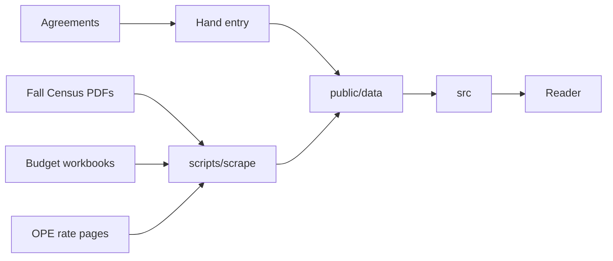

# UO Financials Architecture

## Overview

UO Financials is a static single-page site built with Vite and React. GitHub
Pages serves it from the `uofinancials.github.io` repository. An import script
turns the University of Oregon's Fall Census salary report PDFs, its operational
expenditure budget workbooks, and its blended OPE rate pages into JSON files
committed under `public/data/`. Raise terms from collective bargaining
agreements are entered by hand. The site reads nothing but its bundle and those
files.

## Data

- Fall Census salary reports - classified and unclassified PDFs, one pair per
  census year, published on the Office of Data Enablement's salary reports page
  and downloaded by hand into the gitignored `.cache/sources/fall/`.
- Operational expenditure budgets - one XLSX workbook per fiscal year, linked
  from the Budget and Resource Planning office's Budget Reports page and
  downloaded by `scripts/scrape` into the gitignored `.cache/sources/budget/`.
- Blended OPE rate pages - three Budget and Resource Planning pages (current
  rates, rate history, rate-group matrix), downloaded by `scripts/scrape` into
  the gitignored `.cache/sources/rates/`.
- Collective bargaining agreements and UO salary announcements - read by hand
  for `public/data/raises.json`.
- `public/data/fall/<year>.json` - one census year's job records; written by
  `scripts/scrape`.
- `public/data/budget/FY<yy>.json` - one fiscal year's budget rows by
  department, fund, account type, and posting period, with that year's names;
  written by `scripts/scrape`.
- `public/data/ope.json` - OPE, leave, and PERS repayment rates by rate group
  and year, and the rate groups; written by `scripts/scrape`.
- `public/data/raises.json` - raise terms by employee group, each with its
  citation, and the recorded gaps; edited by hand.
- `public/data/manifest.json` - each dataset's source files and their hashes,
  dates, and counts; written by `scripts/scrape`.

## Flow

## Systems

### Site (`src/`)

- `src/main.tsx` - creates the query client and router and mounts the app.
- `src/app.tsx` - the query and router providers.
- `src/router.tsx` - the route tree, each route's data loading, and the default
  loading, error, and not-found pages.
- `src/pages` - one component per route.
- `src/components` - the shared layout with the independence notice and error
  report link, the source citation caption, the loading and error states, the
  select and radio fields, the totals chart and table, the line chart, the
  trends table and controls, and the department budget and jobs sections.
- `src/components/ui` - shadcn/ui components.
- `src/data` - the schemas and types of the committed data files, and the
  queries that fetch and parse them.
- `src/lib` - census totals by group, college or VP area assignment, the
  cross-year employee groups and their trends, budget account groups, a
  department's budget and jobs, the department index, each page's URL state,
  source citations, number formatting, and the person links between consecutive
  Fall years.
- `src/test` - shared test fixtures.

### Import (`scripts/`)

- `scripts/scrape/main.ts` - the `pnpm scrape [dataset]` command: runs the
  dataset steps and writes the manifest.
- `scripts/scrape/fall.ts` - the Fall step: reads the downloaded reports and
  writes the year files.
- `scripts/scrape/budget.ts` - the budget step: downloads the workbooks and
  writes the year files.
- `scripts/scrape/rates.ts` - the rates step: downloads the OPE pages and writes
  the rates file.
- `scripts/scrape/fetch.ts` - network access: robots.txt, identification,
  request spacing, and the conditional download cache.
- `scripts/scrape/robots.ts` - robots.txt rules.
- `scripts/scrape/manifest-file.ts` - reading and writing the manifest.
- `scripts/scrape/pdf-lines.ts` - PDF pages as positioned text lines.
- `scripts/scrape/fall-file.ts` - one Fall Census report: its identity and its
  records.
- `scripts/scrape/fall-blocks.ts` - report pages split into labelled record
  blocks.
- `scripts/scrape/fall-record.ts` - a record block as a typed record.
- `scripts/scrape/mojibake.ts` - repair of the reports' encoding damage.
- `scripts/scrape/possible-student.ts` - the possible student or graduate
  employee flag.
- `scripts/scrape/budget-links.ts` - the workbook links on the Budget Reports
  page.
- `scripts/scrape/budget-file.ts` - one budget workbook as a typed budget year.
- `scripts/scrape/ope-pages.ts` - the OPE rate pages as typed rates.
- `scripts/scrape/cache.ts` - the source and data locations.
- `scripts/committed-data.test.ts` - schema and total checks of every committed
  data file.

### End-to-end tests (`e2e/`)

- `e2e/home.spec.ts` - the built site's routes, notice, overview, trends,
  departments, sources page, and `404.html`.

## Pages

- `/` - the overview: people, FTE, and salary spend for the latest Fall census,
  by EEO category and by college or VP area; driven by `src/lib` totals and area
  assignment over one Fall year and one budget year.
- `/trends` - salary spend, FTE, and median salary rate by employee group for
  every Fall census, with the view held in the URL; driven by `src/lib` groups
  and trends over every Fall year.
- `/departments` - each college or VP area in the latest census's budget year,
  with its budget units and the latest census's pay departments, filtered by
  name or code; driven by the `src/lib` department index over one Fall year and
  one budget year.
- `/departments/$code` - one code's budget by account group or fund type for
  every budget year, its jobs by group for every Fall census, its jobs by rank
  and position class in one census, and for an area how its jobs were placed;
  driven by the `src/lib` department modules over every Fall and budget year.
- `/sources` - every source file in the manifest and every document the raise
  terms cite, with retrieval dates, hashes, and counts; driven by `src/data` and
  `src/lib`.
- Any other path - the not-found page, inside the shared layout.

## Deployment

- `.github/workflows/ci.yml` - on every push and pull request, runs the checks,
  unit tests, and end-to-end tests; on `main`, publishes `dist/` to Pages.
- `pnpm build` writes `dist/404.html` as a copy of `index.html`, so Pages serves
  the app for every path.
