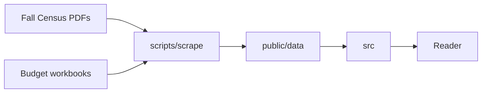

# UO Financials Architecture

## Overview

UO Financials is a static single-page site built with Vite and React. GitHub
Pages serves it from the `uofinancials.github.io` repository. An import script
turns the University of Oregon's Fall Census salary report PDFs and its
operational expenditure budget workbooks into JSON files committed under
`public/data/`. The site reads nothing but its bundle and those files.

## Data

- Fall Census salary reports - classified and unclassified PDFs, one pair per
  census year, published on the Office of Data Enablement's salary reports page
  and downloaded by hand into the gitignored `.cache/sources/fall/`.
- Operational expenditure budgets - one XLSX workbook per fiscal year, linked
  from the Budget and Resource Planning office's Budget Reports page and
  downloaded by `scripts/scrape` into the gitignored `.cache/sources/budget/`.
- `public/data/fall/<year>.json` - one census year's job records; written by
  `scripts/scrape`.
- `public/data/budget/FY<yy>.json` - one fiscal year's budget rows by
  department, fund, account type, and posting period, with that year's names;
  written by `scripts/scrape`.
- `public/data/manifest.json` - each dataset's source files and their hashes,
  dates, and counts; written by `scripts/scrape`.

## Flow

## Systems

### Site (`src/`)

- `src/main.tsx` - mounts the app.
- `src/app.tsx` - the page shell.
- `src/components/ui` - shadcn/ui components.
- `src/data` - the schemas and types of the committed data files.
- `src/lib` - shared helpers.

### Import (`scripts/`)

- `scripts/scrape/main.ts` - the `pnpm scrape [dataset]` command: runs the
  dataset steps and writes the manifest.
- `scripts/scrape/fall.ts` - the Fall step: reads the downloaded reports and
  writes the year files.
- `scripts/scrape/budget.ts` - the budget step: downloads the workbooks and
  writes the year files.
- `scripts/scrape/fetch.ts` - network access: robots.txt, identification,
  request spacing, and the conditional download cache.
- `scripts/scrape/robots.ts` - robots.txt rules.
- `scripts/scrape/manifest-file.ts` - reading and writing the manifest.
- `scripts/scrape/pdf-lines.ts` - PDF pages as positioned text lines.
- `scripts/scrape/fall-file.ts` - one Fall Census report: its identity and its
  records.
- `scripts/scrape/fall-blocks.ts` - report pages split into labelled record
  blocks.
- `scripts/scrape/fall-record.ts` - a record block as a typed record.
- `scripts/scrape/mojibake.ts` - repair of the reports' encoding damage.
- `scripts/scrape/possible-student.ts` - the possible student or graduate
  employee flag.
- `scripts/scrape/budget-links.ts` - the workbook links on the Budget Reports
  page.
- `scripts/scrape/budget-file.ts` - one budget workbook as a typed budget year.
- `scripts/scrape/cache.ts` - the source and data locations.
- `scripts/committed-data.test.ts` - schema and total checks of every committed
  data file.

### End-to-end tests (`e2e/`)

- `e2e/home.spec.ts` - loads the built home page.

## Deployment

- `.github/workflows/ci.yml` - on every push and pull request, runs the checks,
  unit tests, and end-to-end tests; on `main`, publishes `dist/` to Pages.
