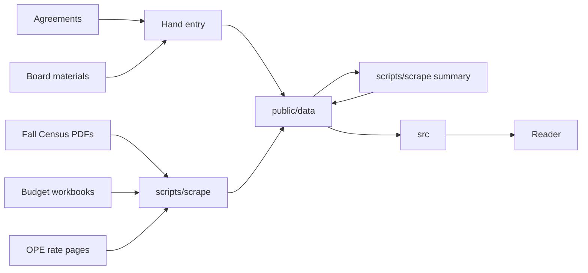

# UO Financials Architecture

## Overview

UO Financials is a static single-page site built with Vite and React. GitHub
Pages serves it from the `uofinancials.github.io` repository. An import script
turns the University of Oregon's Fall Census salary report PDFs, its operational
expenditure budget workbooks, and its blended OPE rate pages into JSON files
committed under `public/data/`, then derives from those files a summary of the
figures the pages show by default. Raise terms from collective bargaining
agreements and the E&G fund projection from Board of Trustees materials are
entered by hand. The site reads nothing but its bundle and those files.

## Data

- Fall Census salary reports - classified and unclassified PDFs, one pair per
  census year, published on the Office of Data Enablement's salary reports page
  and downloaded by hand into the gitignored `.cache/sources/fall/`.
- Operational expenditure budgets - one XLSX workbook per fiscal year, linked
  from the Budget and Resource Planning office's Budget Reports page and
  downloaded by `scripts/scrape` into the gitignored `.cache/sources/budget/`.
- Blended OPE rate pages - three Budget and Resource Planning pages (current
  rates, rate history, rate-group matrix), downloaded by `scripts/scrape` into
  the gitignored `.cache/sources/rates/`.
- Collective bargaining agreements and UO salary announcements - read by hand
  for `public/data/raises.json`.
- Board of Trustees meeting materials and president's office budget pages - read
  by hand for `public/data/outlook.json`.
- `public/data/fall/<year>.json` - one census year's job records; written by
  `scripts/scrape`.
- `public/data/budget/FY<yy>.json` - one fiscal year's budget rows by
  department, fund, account type, and posting period, with that year's names;
  written by `scripts/scrape`.
- `public/data/ope.json` - OPE, leave, and PERS repayment rates by rate group
  and year, and the rate groups; written by `scripts/scrape`.
- `public/data/raises.json` - raise terms by employee group, each with its
  citation and, for across-the-board and pool terms, the populations it applies
  to, and the recorded gaps; edited by hand.
- `public/data/outlook.json` - the E&G fund projection by fiscal year with every
  published line, its alternative cases and assumptions, run rates reported
  since, the all-funds budget, and announced budget actions, each with its
  citation; edited by hand.
- `public/data/summary.json` - every job's trends by group, continuing jobs'
  median pay change by group for every census pair, each area's yearly figures,
  the department table's rows, the home page's figures, and every name's census
  years with the class and rank medians; derived from the other data files by
  `scripts/scrape`.
- `public/data/trends/<area>.json` - one college or VP area's, and each of its
  units' and pay departments', jobs by group in every census and continuing
  jobs' median pay change by group; derived with the summary by
  `scripts/scrape`.
- `public/data/manifest.json` - each dataset's source files and their hashes,
  dates, and counts, and the files and date the summary was derived from;
  written by `scripts/scrape`.

## Flow

```mermaid
flowchart LR
  pdfs[Fall Census PDFs] --> scrape[scripts/scrape]
  xlsx[Budget workbooks] --> scrape
  html[OPE rate pages] --> scrape
  cba[Agreements] --> hand[Hand entry]
  board[Board materials] --> hand
  hand --> json[public/data]
  scrape --> json[public/data]
  json --> summary[scripts/scrape summary]
  summary --> json
  json --> site[src]
  site --> reader[Reader]
```

## Systems

### Site (`src/`)

- `src/main.tsx` - loads the typeface and stylesheet, creates the query client
  and router, and mounts the app.
- `src/index.css` - the theme: color tokens for light and dark schemes, the type
  scale, radius, and the focus and link styles.
- `src/app.tsx` - the query and router providers.
- `src/router.tsx` - the route tree, each route's data loading, each page's code
  loaded on demand, and the default loading, error, and not-found pages.
- `src/pages` - one component per route.
- `src/components` - one folder per area:
  - `layout` - the shared layout with the independence notice and error report
    link, page sections, stat cards, the sources disclosure and inline source
    citations, the navigation and tab link style, and loading and error states.
  - `fields` - form fields, the department or area picker, a type-to-search
    picker, the removable filter, and the sortable column header.
  - `charts` - line, index, and stacked bar charts, ranked bars of a change,
    bars in table cells, the charts' tables, and series colors.
  - `home` - the home page's scenario answers, area breakdown, and top-paid
    table.
  - `trends` - the Trends report's filters, tabs, sections, and group table, the
    pay changes page's controls and sections, the group mapping, and the jobs
    figure and table the department page shares.
  - `departments` - the department table and a department's budget and jobs.
  - `people` - the people list's controls, table, and figures.
  - `person` - one name's figures, rates, records, and job history.
  - `budget` - the budget outlook's lines and cases tables.
  - `scenario` - rule editing and the scenario's results, savings, and outlook.
  - `ui` - shadcn/ui components.
- `src/hooks` - the hooks and queries that load and join the data files for a
  page's view.
- `src/data` - the schemas and types of the committed data files, and the
  queries that fetch and parse them.
- `src/lib` - class name merging and the number cell style, and one folder per
  domain:
  - `shared` - number formatting, table sort order, source citations, and the
    rules charts draw series by.
  - `census` - census totals, area assignment, employee groups, and the salary
    rate distribution.
  - `trends` - trends by group and by area, the report's indexes, changes, spend
    shares, and answers, continuing jobs' pay changes, and raise groups beside
    their terms.
  - `departments` - a department's budget and jobs, the department index, and
    the department table.
  - `people` - the people list, person links and lookup, and a person's computed
    figures and peer medians.
  - `budget` - the budget outlook's gap, series, and cited sources.
  - `scenario` - scenario rules, their editing and examples, and the savings
    they produce against the projection.
  - `home` - the home page's figures.
  - `summary` - the summary of the pages' default figures.
- `src/test` - shared test fixtures.

### Import (`scripts/`)

- `scripts/scrape/main.ts` - the `pnpm scrape [dataset]` command: runs the
  dataset steps and writes the manifest.
- `scripts/scrape/summary.ts` - the summary step: derives the summary file and
  the area trends files from the committed data files.
- `scripts/scrape/cache.ts` - the source and data locations, and the committed
  JSON reader.
- `scripts/scrape/manifest-file.ts` - reading and writing the manifest.
- `scripts/scrape/net` - network access: robots.txt rules, identification,
  request spacing, and the conditional download cache.
- `scripts/scrape/fall` - the Fall step: PDF pages as text lines, record blocks,
  typed records, encoding repair, and the possible student or GE flag.
- `scripts/scrape/budget` - the budget step: the workbook links on the Budget
  Reports page, and each workbook as a typed budget year.
- `scripts/scrape/rates` - the rates step: the OPE rate pages as typed rates.
- `scripts/committed` - checks of the committed data files, and of the figures
  derived from them, against their sources.

### End-to-end tests (`e2e/`)

- `e2e/home.spec.ts` - the built site's routes, notice, navigation, a
  department's jobs link, the people list and person page, sources page, and
  `404.html`.
- `e2e/overview.spec.ts` - the home page's headlines, scenario answers, area
  preview, trend and top-paid previews, and narrow layout, and the People page's
  spend by EEO category.
- `e2e/departments.spec.ts` - the departments table's sorting, levels, and
  filters, a unit's and an area's pages, the scenario and pay changes links, and
  narrow layout.
- `e2e/budget.spec.ts` - the budget page's gap by year, scope, cases, and
  sources.
- `e2e/scenarios.spec.ts` - the scenarios page's examples, rule editing, hiring
  and raise freezes, eliminations, cases, unreadable link entries, and narrow
  layout.
- `e2e/trends.spec.ts` - the Trends report's tabs, answers, and tables, its
  filters and area or unit scope, older links, scroll position, and narrow
  layout.
- `e2e/trends-change.spec.ts` - the pay changes page, its filters, its raise
  comparison, older links to it, and its link from the person page.
- `e2e/sources.ts` - opening a page's sources disclosures.

## Pages

- `/` - the portal: headline figures from the projection, the budget, and the
  latest Fall census, the projected gap as a chart, two scenario examples'
  savings against the gap, job records per census, the largest colleges and VP
  areas by a measure held in the URL, the highest published salary rates, and
  the data's dates, each linking to its page; driven by `src/lib/home` over the
  summary, the outlook, the raise terms, and the manifest.
- `/trends` - a report of the Fall censuses for all of UO, a college or VP area,
  or a unit, over a year range, with the filters and tab held in the URL: spend,
  jobs, median rate, and admins and executives per 100 faculty since the first
  census, then one tab per question: each group's growth as ranked bars or
  indexed over time; each group's share of spend and of its change; the change
  in spend split into FTE and pay per FTE; continuing jobs' median raises by
  group and census pair; the pick against up to three areas or units from
  anywhere and the university; and how groups are defined; driven by
  `src/lib/trends` over the summary and, for a picked area or unit, that area's
  trends file.
- `/trends/pay-changes` - for continuing jobs in each pair of consecutive
  censuses, the median change in salary rate by group, the counts of changed
  class, rank, and title, and one pair's distribution of changes and median
  change by raise group beside its across-the-board terms; filtered by group,
  staff kind, pay department, college or VP area, or class or rank, with the
  view held in the URL; driven by `src/lib/census`, `src/lib/trends`, and the
  `src/lib/people` person links over every Fall year and the raise terms, and
  `src/lib/departments` over every budget year when filtered by area.
- `/departments` - a sortable table of the colleges and VP areas in the latest
  census's budget year, or of their units and pay departments, with budget,
  jobs, spend, and median and each one's change from the year before, filtered
  by area and by name or code; driven by the summary's department table rows.
- `/departments/$code` - one code's budget by account group or fund type for
  every budget year, its jobs by group for every Fall census, its jobs by rank
  and position class in one census, for an area its units in the department
  table and how its jobs were placed, and links to a scenario eliminating it and
  to its pay changes; driven by `src/lib/departments` over every Fall and budget
  year, and the outlook file for the scenario's budget year.
- `/people` - one Fall census's jobs by name, filtered, sorted, and paged, with
  a chart of the matching jobs by salary rate, with primary-job percentiles, or
  a table of them by group, their salary spend by EEO category, and names from
  other censuses when a name has no job in it; not indexed by search engines;
  driven by the `src/lib/people` list and `src/lib/census` distribution over one
  Fall year and its budget year, and the summary's name index.
- `/people/$name` - one name's computed figures, its rates by job over time, its
  records for one census at a time, and its job history, with a back button; not
  indexed by search engines; driven by `src/lib/people` over the summary's name
  index and medians and the Fall years the name appears in.
- `/budget` - the E&G fund projection: the gap and fund balance by fiscal year
  as a chart and table, every published line, the alternative cases, the
  reduction estimate, the all-funds budget, the stated assumptions, and the
  announced budget actions, each cited; driven by `src/lib/budget` over the
  outlook file.
- `/scenarios` - rules over the latest Fall census, grouped by the stage each
  runs in and edited in place, with each rule's jobs and salary, full cost, and
  E&G savings, each elimination's budgeted pay, OPE, and S&S, the first savings
  year's raise rates that savings grow by and a raise freeze forgoes, with their
  sources, the savings set against the E&G projection or one of its cases by
  fiscal year, example questions, the stated methods, and the sources, with the
  rules and case held in the URL; driven by `src/lib/scenario` over one Fall
  year, its budget year, the budget year of the first savings year, the OPE
  rates, the raise terms, and the outlook file, and every Fall year from 2019
  when a hiring freeze is present.
- `/sources` - every source file in the manifest and every document the raise
  terms and the budget outlook cite, with retrieval dates, hashes, and counts;
  driven by `src/data`, `src/lib/shared`, and `src/lib/budget`.
- Any other path - the not-found page, inside the shared layout.

## Deployment

- `.github/workflows/ci.yml` - on every push and pull request, runs the checks,
  unit tests, and end-to-end tests; on `main`, publishes `dist/` to Pages.
- `pnpm build` writes `dist/404.html` as a copy of `index.html`, so Pages serves
  the app for every path.
